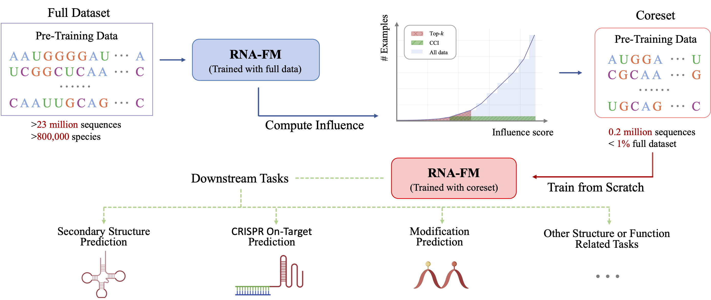

# Investigating Data Pruning for Pretraining Biological Foundation Models at Scale

This repository contains the official source code of our work:

**Investigating Data Pruning for Pretraining Biological Foundation Models at Scale**  
Yifan Wu\*¹², Jiyue Jiang\*¹†, Xichen Ye², Yiqi Wang³, Chang Zhou¹, Yitao Xu¹, Jiayang Chen¹,  
He Hu⁴, Weizhong Zhang²†, Cheng Jin², Jiao Yuan⁵⁶†, Yu Li¹†  
¹The Chinese University of Hong Kong  
²Fudan University  
³Shanghai University  
⁴Guangdong Laboratory of Artificial Intelligence and Digital Economy (SZ)  
⁵Guangzhou National Laboratory  
⁶Guangzhou Medical University  

Emails: victorwu@link.cuhk.edu.hk, weizhongzhang@fudan.edu.cn, yuanjiao@gzlab.ac.cn, liyu@cse.cuhk.edu.hk  
(*Equal contribution, †Corresponding authors*)

---

## 📌 Main Framework Overview

  

---

